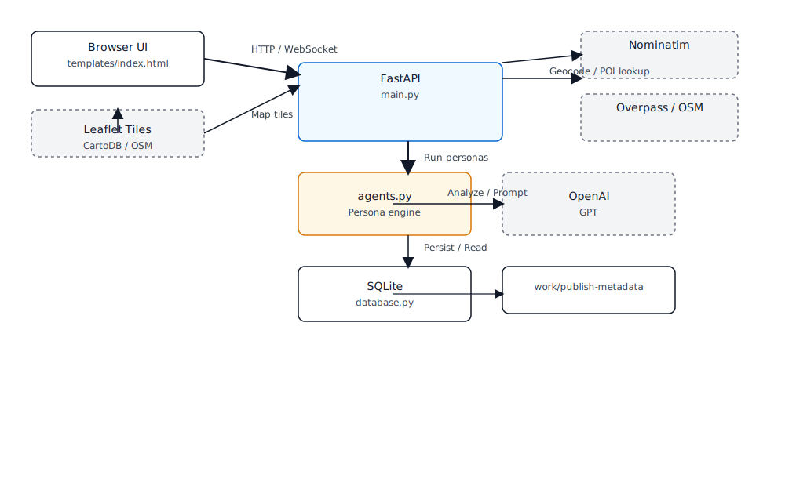

# OpenAI Build Week Submission

# NomadNest AI
Track / Category : Apps for Your Life

# What is NomadNest AI ?
NomadNest AI is an advanced consumer lifestyle utility designed to eliminate the logistical blind spots, spatial anxieties, and hidden friction points associated with selecting a new neighborhood or property location.

# Project Description
NomadNest AI is a fully functional neighborhood lifestyle "digital twin" simulator. Traditional mapping tools provide flat, static locations, leaving relocators to guess about actual traffic density, school-rush gridlocks, or late-night noise corridors. NomadNest AI evaluates any precise real-world coordinate payload using open-source GIS pipelines combined with an asynchronous multi-agent LLM workflow. NomadNest AI is a hyper-local neighborhood and living simulator for Malaysian locations. It geocodes a target location, finds named nearby OpenStreetMap facilities, and turns the spatial context into a 24-hour livability timeline.


## What it does

- Resolves Malaysian addresses, towns, districts, and neighborhoods with Nominatim.
- Displays the target with Leaflet and CartoDB Dark Matter OpenStreetMap tiles.
- Extracts named facilities within a 2 km radius: transit, schools, health services, groceries, eateries, nightlife, and major roads.
- Lets the user filter the NearBy panel and map markers down to 1 km without running a new simulation.
- Runs two concurrent personas: Persona A (Commuter) and Persona B (Light Sleeper).
- Persists target locations, runs, POI snapshots, and timeline manifests in SQLite.

## Stack

| Layer | Technology |
| --- | --- |
| Web server | FastAPI + Uvicorn |
| Persistence | SQLite + SQLAlchemy |
| Map | Leaflet + CartoDB Dark Matter + OpenStreetMap |
| Geocoding | Nominatim OpenStreetMap API |
| Spatial facilities | Overpass API / OpenStreetMap |
| AI | Official OpenAI Python SDK, `gpt-5.6` |
| UI | HTML5, Tailwind CSS, vanilla JavaScript |

## Setup

Prerequisites: Python 3.11+ and internet access for live map tiles, Nominatim, and Overpass.

```powershell
cd "C:\Users\User\Documents\Codex\2026-07-14\you-are-a-senior-full-stack"
python -m venv .venv
.\.venv\Scripts\Activate
pip install -r requirements.txt
```

Optional: enable GPT-5.6 persona analysis for the current PowerShell session.

```powershell
$env:OPENAI_API_KEY="your_openai_api_key"
$env:OPENAI_MODEL="gpt-5.6"
```

Start the application:

```powershell
python -m uvicorn main:app --host 127.0.0.1 --port 8000
```

Open `http://127.0.0.1:8000`.

If the OpenAI key is absent, NomadNest AI uses a resilient local persona engine so the product remains demonstrable. If the server-side public geocoder is temporarily unavailable, the UI retries Malaysian geocoding and facility lookup in the browser.

## Sample searches

Use any Malaysian address or place name, for example:

- `Iskandar Puteri, Johor`
- `Tapah, Perak`
- `Shah Alam, Selangor`
- `Kota Bharu, Kelantan`

After a simulation, select **1 KM** or **2 KM** in Section A to filter the displayed facilities and markers.

## Architecture and data flow

1. The browser submits a location and run type to `POST /api/simulate`.
2. FastAPI normalizes the location, rate-limits Nominatim calls, and caches repeated searches.
3. The resolved coordinates query named OSM facilities via Overpass within 2 km.
4. The raw POI array is included in both persona prompts.
5. The two personas run concurrently with `asyncio.gather()` and return precise timeline incidents.
6. FastAPI merges and stores the result in SQLite, then returns one payload that updates the map, NearBy facilities, timeline, score, and live agent monitor together.

### System Architecture Diagram



## How Codex accelerated the project

Codex accelerated the implementation by building the complete FastAPI/SQLite/Leaflet stack, wiring the front-end state into the unified simulation response, and repeatedly validating Python and browser-script syntax. It also helped diagnose real execution issues: local server lifecycle, unavailable public geocoder connectivity, empty server-side POI arrays, and stale UI state. The resulting resilience path prevents a failed network dependency from collapsing the entire dashboard.

1. Asynchronous Parallelism: Codex wrote the complex boilerplate required for Python’s asyncio.gather(), letting the application execute parallel multi-agent prompts against the OpenAI SDK without blocking the primary FastAPI execution pipeline.

2. GIS Coordinates Filtering Engine: Codex generated the spatial distance formula calculations that successfully filter the OpenStreetMap named place lists down into categorized proximity metrics (Transit, School, Emergency, Eateries) in real-time.

Key product decisions made during implementation:

- Choose Leaflet + OpenStreetMap instead of a vendor-locked map service.
- Use a 2 km collection radius for rich context, with a 1 km UI filter for denser local inspection.
- Keep OpenAI analysis optional so demos work without credentials.
- Separate live OSM data collection from deterministic local fallback behavior to preserve a usable experience during temporary network outages.

## How GPT-5.6 is used

When `OPENAI_API_KEY` is configured, the official OpenAI Python SDK sends the location coordinates, run type, traffic/noise estimates, and the raw named facility array to GPT-5.6. Two prompts are called concurrently:

- **Persona A: Commuter** analyzes transit, schools, grocery access, road pressure, and daytime friction.
- **Persona B: Light Sleeper** analyzes nightlife, eateries, roads, emergency-service access, and overnight sound risk.

The JSON events are schema-checked, merged into a time-sorted 24-hour timeline, persisted, and rendered as pulse markers and detailed cards.

## Public data service guidance

The public Nominatim service is rate-limited to one request per second and receives an identifying User-Agent. For sustained or commercial production traffic, configure a self-hosted or dedicated Nominatim/Overpass provider. Respect the [Nominatim usage policy](https://operations.osmfoundation.org/policies/nominatim/).


